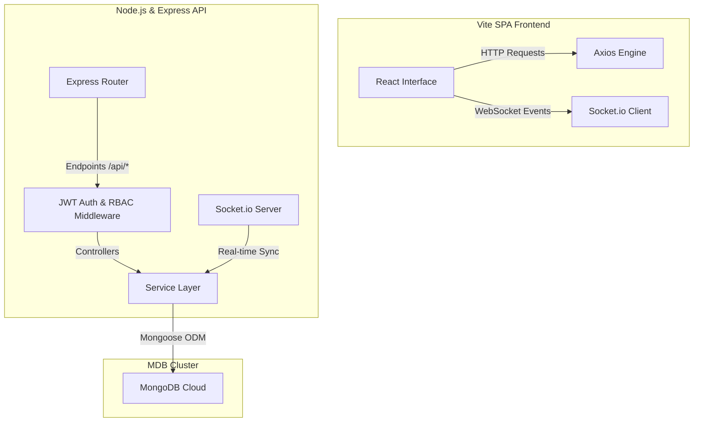

# 🚀 TaskNova — Collaborative MERN Task Workspace

**TaskNova** is a premium, high-performance project management application designed for modern high-velocity teams. Built on the MERN stack and powered by real-time Socket.io channels, TaskNova delivers a unified workspace for project tracking, task delegation, team collaboration, and deep analytics.

---

## ⚡ Tech Stack & Architecture

TaskNova is engineered as a decoupled monorepo combining a robust Node/Express REST & WebSocket backend with a reactive React Single Page Application (SPA).



### Core Technologies
*   **Frontend SPA**: [React v18](https://reactjs.org/) (bootstrapped with Vite), [Tailwind CSS](https://tailwindcss.com/) for custom utility styling, [Framer Motion](https://www.framer.com/motion/) for fluid 3D keyframe animations, [Lucide React](https://lucide.dev/) for crisp vector iconography, and [Recharts](https://recharts.org/) for beautiful data visualization.
*   **Backend Engine**: [Node.js](https://nodejs.org/) & [Express](https://expressjs.com/) with asynchronous middleware pipelines and security layers (CORS, Helmet).
*   **Real-time Layer**: [Socket.io](https://socket.io/) for persistent full-duplex TCP channels ensuring real-time workspace updates.
*   **Database Cloud**: [MongoDB Atlas](https://www.mongodb.com/) mapped via [Mongoose ODM](https://mongoosejs.com/) schemas.
*   **Security & Encryption**: Stateful [JSON Web Tokens (JWT)](https://jwt.io/) for authorization alongside [bcrypt.js](https://github.com/kelektiv/node.bcrypt.js) salted hashing.

---

## ✨ Features Portfolio

### 1. Public Landing Gateway
*   **Exact Wavy Curve**: An ultra-clean white canvas showcasing a precise diagonal SVG wave backdrop gradient (`from-[#C084FC] via-[#8B5CF6] to-[#4F46E5]`) matching premium modern SaaS reference mockups.
*   **Dominant floating Visual**: An expanded `/hero_image.png` centerpiece that floats vertically in mid-air on spring paths, casting a dynamic resizing shadow on its ground plate.
*   **Zero Link Clutter**: Only features a branding logo and a single contextual CTA button ("Sign In" / "Workspace") on a flat, clean top navbar.

### 2. Bespoke Authentications
*   Custom **Login & Signup views** equipped with responsive 3D card carousels.
*   Integrated transparent illustrations cycling on layout timers.
*   Role-Selection selector (Admin vs. Member) that determines user routing immediately.

### 3. Role-Based Access Control (RBAC)
*   **Admin Workspace Dashboard**: 
    *   Top-row statistics cards tracking total projects, ongoing tasks, team headcounts, and overdue events.
    *   Dual-chart data grids plotting daily task velocity (area chart) and category distributions (pie charts).
    *   Conditional warnings for overdue tasks, recent activity feeds, and a project completion progress card.
*   **Member Workspace (`/my-tasks`)**:
    *   A clean, isolated view showing only tasks assigned to the specific logged-in member.
    *   Responsive **Grid / List layout toggles** designed for clean and rapid task filtering.

### 4. Interactive Project & Task Engines
*   **Projects Workspace**: Allows creating projects, managing descriptions, and delegating user access.
*   **Kanban Task Boards**: Create, edit, and move cards across workspace columns (To Do, In Progress, Testing, Completed).
*   Supports task descriptions, custom categories (Design, Backend, DevOps, Frontend), priority status tags (High, Medium, Low), and comment boards for team conversation.

---

## 📁 Repository Directory Mapping

```
team-task-manager/
├── backend/
│   ├── config/             # Database connectivity & environment configs
│   ├── controllers/        # Business controllers (Auth, Task, Project, Dashboard)
│   ├── models/             # Mongoose Schemas (User, Project, Task, Notification)
│   ├── routes/             # REST endpoints (auth, task, project, user, notifications)
│   ├── middleware/         # Auth guards, role-based protection (isAdmin)
│   ├── seeds/              # Database populator scripts
│   └── server.js           # Express main server & Socket.io initialization
├── frontend/
│   ├── public/             # Static visual assets (logo, hero_image.png)
│   ├── src/
│   │   ├── components/     # UI widgets (sidebar, taskboards, notifications)
│   │   ├── context/        # Auth & global state managers
│   │   ├── pages/          # Full-page views (Landing, Dashboard, Member Workspace)
│   │   ├── App.jsx         # Pathless layout router
│   │   └── main.jsx        # App entry point
└── package.json            # Root orchestrator (concurrent dev starts)
```

---

## 🚀 Quick Start Developer Guide

### 1. Dependency Installation
Initialize all node packages recursively for both backend and frontend from the monorepo root:
```bash
npm run install-all
```

### 2. Configure Environment Configurations
Create a `.env` file inside the `backend` folder matching these environment variables:
```env
PORT=5000
JWT_SECRET=super_secret_tasknova_jwt_key_2026
MONGO_URI=mongodb+srv://<user>:<password>@cluster0.mongodb.net/tasknova?retryWrites=true&w=majority
CLIENT_URL=http://localhost:3000
```

### 3. Seed Mock Database (Optional)
To instantly populate the database with a pre-configured administrator account, project models, and mock task cards:
```bash
npm run seed
```
**Seed Administrator Credentials:**
*   **Email**: `admin@example.com`
*   **Password**: `password123`

### 4. Run Locally
Boot up both the Node/Express backend and Vite frontend development engines simultaneously:
```bash
npm run dev
```
*   **Frontend Dev Server**: [http://localhost:3000](http://localhost:3000) (auto-opens in your default browser)
*   **Backend REST/WS API**: [http://localhost:5000](http://localhost:5000)
